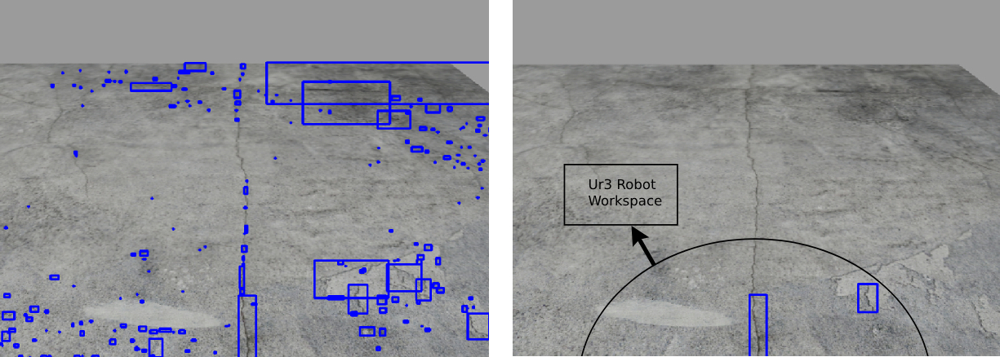
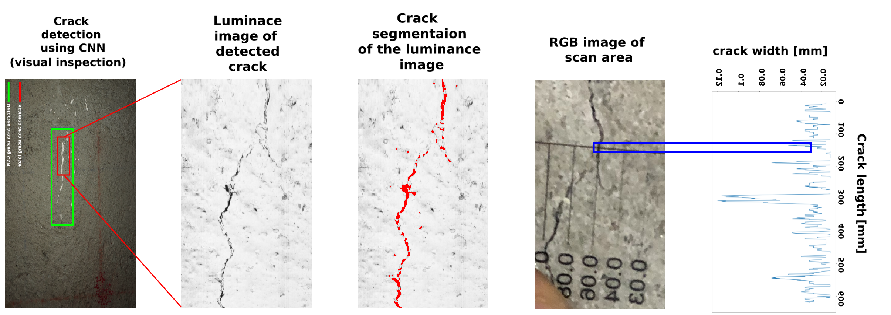
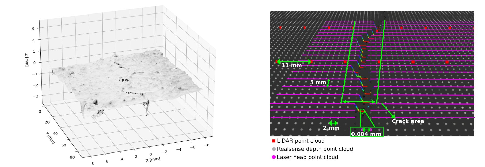

# Multi-Scale Robotic Crack Measurement in Concrete Structures

[](https://doi.org/10.1016/j.autcon.2023.105215)

## 💑 Publication
This repository contains the source code and datasets for the **Multi-Scale Robotic Crack Measurement** approach introduced in the paper:
- 📝 **Title:** A Multi-Scale Robotic Approach for Precise Crack Measurement in Concrete Structures
- 📚 **Journal:** Automation in Construction (2024)
- 🔗 **[Read the Full Paper](https://doi.org/10.1016/j.autcon.2023.105215)**

---

The repository provides:
- **ROS Package** for controlling a robotic arm for crack inspection.
- **CNN Model** for detecting and segmenting cracks using computer vision.
- **Uses the Universal Robot package as part of its structure.**
- **Includes parts of the Jackal package for building the structure.**

## 🚀 Getting Started
Install required dependencies. We tested on ROS noetic (Ubuntu 20.04.6 LTS)
```bash
pip install torchvision
sudo apt-get install ros-noetic-trac-ik-kinematics-plugin
sudo apt install ros-noetic-moveit-commander
sudo apt install ros-noetic-moveit-python
sudo apt install ros-noetic-moveit
pip install tqdm
pip install pandas
pip install albumentations
sudo apt-get install ros-noetic-ros-control ros-noetic-ros-controllers
sudo apt-get install ros-noetic-velodyne-*
sudo apt-get install ros-noetic-realsense2-camera
```


### 1️⃣ Clone the Repository
The **ROS package** is built inside `catkin_ws`. Ensure you have **ROS (Melodic/Noetic)** installed.
```bash
cd catkin_ws
cd src
git clone https://github.com/ali-qdmz/A-multi-scale-robotic-approach-for-precise-crack-measurement-in-concrete-structures
cd ..
catkin_make
source devel/setup.sh
```
### 2️⃣ ROS Package Setup

Run the robotic inspection using the bash script provided
```bash
./script.sh
```

### 3️⃣ Running the CNN Model
The crack detection model is based on **U-Net**. To test the model and download it from Google Drive, [click here](https://drive.google.com/file/d/1L4OmKD-teFMR5Y0WEqxjo4qtnxc5zd1P/view?usp=sharing).

First run ur3_control to move the arm to initial position:

```bash
python ur3_control.py
```

Then run the model, and visualize the real-time results in Rviz in topic named "model_result_image"

```bash
python ros_unet.py
```

The simulation environment should look as below:

<div align="center">
    
</div>


## 📂 Repository Structure
```yaml
├── jackal_velodyne/      # Jackal ROS package for mobility
├── realsense-ros/        # Intel RealSense camera drivers
├── universal_robot/      # Universal Robot ROS package
├── ros_package/          # ROS package for robotic crack inspection
├── cnn_model/            # CNN model for crack detection
├── data/                 # Experimental and simulation datasets
├── results/              # Analysis and output visualizations
│   ├── 3D_reconstruction.png  # 3D point cloud reconstruction
│   ├── crack_res.png          # Crack detection results
│   ├── crack_sim.png          # Crack simulation image
│   ├── experimental_setup.png # Experiment setup diagram
│   ├── simulation_setup.jpg   # Simulation setup visualization
├── scripts/              # Utility scripts
│   ├── move_it.py        # Script for UR3 robotic movement
│   ├── ur3_control.py    # UR3 robotic arm control script
│   ├── ros_unet.py       # Crack detection using CNN model
│   ├── script.sh         # Bash script for automation
├── .rosinstall           # ROS workspace installation dependencies
├── CMakeLists.txt        # ROS build system file
├── README.md             # Main project documentation
├── LICENSE               # License information
```

## 📊 Results and Visualizations

### 📌 Simulation Crack Detection Output
<div align="center">
    
</div>


### 📌 Real World Crack Detection Output

<div align="center">
    
</div>

<div align="center">
    
</div>


### 📌 High Resolution Crack 3D Reconstruction and Comparision Between LiDAR, Depth Camera and Laser Scanner
<div align="center">
    
</div>


## 📧 Contact
For inquiries, feel free to contact:  
📩 **Ali Ghadimzadeh Alamdari** – [ali.ghadimzadeh@gmail.com](mailto:ali.ghadimzadeh@gmail.com)  
